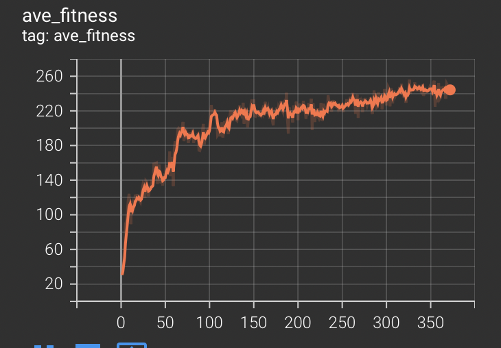
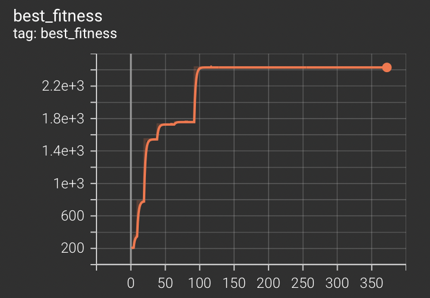
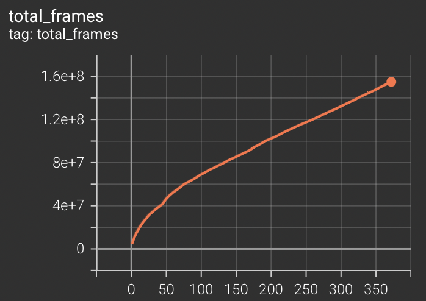

This is a work in progress. 

Reproduction of the paper "Deep Neuroevolution: Genetic Algorithms are a Competitive 
Alternative for Training Deep Neural Networks for Reinforcement Learning."
https://arxiv.org/pdf/1712.06567.pdf

Also using as a way to learn how to run distributed computing on clusters on aws spot
instances.

Currently distributed.py has options for to use local synchronous computation,
python multiprocessing, or RabbitMQ.

scripts/build.sh builds the image for kubernetes master/worker pods
scripts/start.sh deploys master, worker, rabbitmq, and tensorboard pods/services
to the cluster.

Current status 2/28/24: 
First large-ish training learned reasonably well on Frostbite, however since then
I have made some improvements to network initialization and made the mutation std 
adjustable. Currently I have a hypothesis that genetic algorithms will struggle to learn
late in training as each new mutation is highly likely to "overwrite" previously learned
techniques. I am testing this with "MemorizationDataset" in evaluations.py (just to
see if the genetic algorithm as I have implemented it now is capable of memorizing 
completely random datapoints).

Below are some graphs of my first attempt training Frostbite:

In this graph the x-axis is generation, y-axis is average population score

In this graph the x-axis is generation, y-axis is best reward over all time (averaged over
3 runs for each agent)

This graph is just to track the total number of frames we've trained on.
In this graph the x-axis generation and the y-axis is the total environment frames divided by 4
(I'm off by a factor of 4 because I forgot atari env rolls out 4 frames per training timestep).

This is costing me about $15 a day, I probably should work on bringing that down more, it adds up
fast! (This is with 10 c7a.medium spot instances.)
