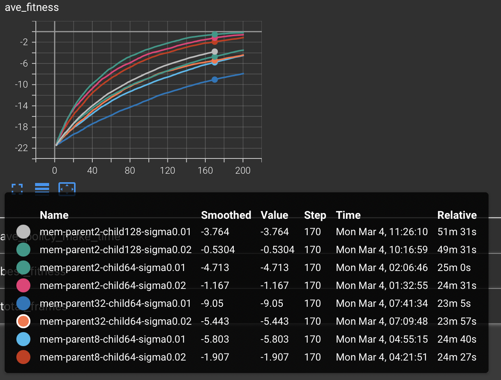

This is a work in progress. 

Reproduction of the paper "Deep Neuroevolution: Genetic Algorithms are a Competitive 
Alternative for Training Deep Neural Networks for Reinforcement Learning."
https://arxiv.org/pdf/1712.06567.pdf

Also using as a way to learn how to run distributed computing on clusters on aws spot
instances.

Currently distributed.py has options for to use local synchronous computation,
python multiprocessing, or RabbitMQ.

scripts/build.sh builds the image for kubernetes master/worker pods
scripts/start.sh deploys master, worker, rabbitmq, and tensorboard pods/services
to the cluster.

Current status 3/5/24: 
First large-ish training learned reasonably well on Frostbite, however since then
I have decided to take some time exploring GA hyperparameters on a very simple toy problem,
and comparing to backpropogation. The toy problem is memorizing a dataset of images of random 
gaussian noise, with random labels of 10 classes. For 64 datapoints, SGD gets to 1e-5 loss
on training dataset in approximately 100 optimization steps. Results so far on GA show that
a convergence is faster with a small number of parents (2 vs 8 vs 64), and while increasing the
children in each generation does result in faster convergence by generation, it hurts wall time.
Also, using sigma=0.02 was the best of [0.08,0.04,0.02,0.01,0.005,0.002]. 
Now I want to try to see how GA performs when there is no exact gradient - the loss will just be
the number of incorrect classes (using argmax)

Below are some graphs of my first attempt training Frostbite:

In this graph the x-axis is generation, y-axis is average population score

In this graph the x-axis is generation, y-axis is best reward over all time (averaged over
3 runs for each agent)

This graph is just to track the total number of frames we've trained on.
In this graph the x-axis generation and the y-axis is the total environment frames divided by 4
(I'm off by a factor of 4 because I forgot atari env rolls out 4 frames per training timestep).

This is costing me about $15 a day, I probably should work on bringing that down more, it adds up
fast! (This is with 10 c7a.medium spot instances.)
