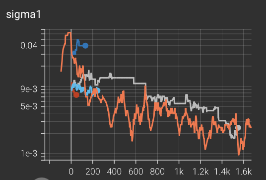

# Genetic Algorithms on MNIST

This post explores training a simple MLP on MNIST, using genetic algorithms.

## The SGD baseline

A simple training of a MLP with 128 hidden neurons on MNIST using SGD is implemented in code/gradient.py. 
Without tuning the hyperparameters all that much, we can get to 95% valset acc in 4 epochs.

TODO add a graph for the number of network updates it takes to reach 95%.

## A simple asexual genetic algorithm

We begin with a simple genetic algorithm, very similar to that implemented in the paper https://arxiv.org/abs/1712.06567.
Chromosomes consist of strings of integers. Each integer specifies a unique mutation to the network. 
The network is initialized using He initialization, using some fixed seed, and then the final network is constructed as follows:

For each integer in the chromosome, in order, we set the seed of the torch random number generator to that integer, and then 
we generate a perturbation to the weights of the network using that seed. The perturbation is multiplied by some learning rate 
and then added to the weights of the network. The way I set (and evolve) the learning rate is explored in the "Learning rates" section below.

Once the network has been constructed, the fitness of an individual is the cross entropy loss over the entire MNIST training dataset.
In the section "Batch sizes" below we will investigate what happens when we only evaluate individuals on subsets of the MNIST dataset.
And in the section "Fitness types" below we will investigate using other types of fitnesses.

### What kind of perturbation should we use? 

The paper linked above generated the perturbations by sampling from a
normal distribution with mean 0 and standard deviation sigma. 
However it is not clear that this is the distribtuion from which to sample parameter mutations.
So this section will investigate if any other distributions perform better.

Initially, I decided to inspect the distribution of the partial derivatives over all parameters during normal SGD, and use
this (approximate) distribution in genetic algorithm mutations as well. Investigating the partial derivatives during
gradient descent, we see that their distribution is much sharper than a normal distribution, closer to an exponential distribution:

So we can see that the actual updates during gradient descent will look more like the exponential distribution than the normal
one. (Note that something like a squared normal distribution or a squared exponential distribution could be even better,
but I just tested exponential in this post).

However, when I try mutating the parameters with an exponential distribution rather than a normal distribution, performance
decreases. What if we went the other extreme and used a uniform distribution? This too is worse than a normal distribution.
So it seems that making the distribution of random parameter updates have a heavier tail (exponential distribution) and a 
lighter tail (uniform distribution) both result in worse performance. 

TODO add graph

The normal distribution is radially symmetric, which is an appealing quality for mutations. 
But how are we to reconcile this result with the gradient descent distribution looking more exponential? 
If the true gradient distribution (as a random variable) is not radially symmetric, why would a radially symmetric
mutation perform the best?

Well, if we consider the true gradient to be a random vector with each component drawn from an exponential distribution,
then we can compute its dot product with normal mutations and compare with exponential mutations to see if one is likely to
perform better. The below graph shows this computation, and shows that exponential mutations are not more likely to 
align with the true gradient than normal mutations are (the plot also shows the uniform distribution).

I am not sure why emperically the normal distribution seems to perform better than these other two. TODO investigate 

From now on in the following sections, I always use the normal distribution to mutate the parameters.

### Learning Rates
The symmetric normal distribution is controlled by a single parameter - sigma. Futhermore, the normal distribution family is 
closed under multiplication by a scalar:

TODO insert formula

So we can think of the sigmas for each layer as determining the learning rate of the algorithm - increasing sigma will result in 
larger magnitude updates after each mutation. Like gradient descent, genetic algorithms perform best when this learning rate changes over time,
decreasing as training converges. This can be accomplished easily by simply allowing these parameters to mutate along with all other parameters
of the model. During each mutation, sigma is either multiplied by some scaling factor
gamma, divided by gamma, or kept constant, each with equal probability. 

The below tensorboards shows training MNIST to ~95% acc using three different values of gamma: 1.05, 1.1, and 1.3.  

We can see the algorithm is relatively robust to the value of gamma in this range. I use 1.05 in the following experiments since it performed the best 
of these three. When training this way, we can see how the values of sigma for each matrix in the MLP change over training:

As expected, the sigmas decrease over training. Additionally, notice how the light blue curve has much higher swings than the other curves.
That is because this curve uses gamma=1.3. Most of the curves on this graph use gamma=1.05. The gray curve uses gamma=1.1.

Now, check how letting sigma mutate like this compares to just training with a constant sigmas. We compare
training with gamma=1.05 to training with gamma=1 (no sigma mutation) and constant values of sigma taken from the beginning of these
curves, the middle, and the end.

In the above image, the red curve and blue curves are training runs with gamma=1.05. The gray, green, and pink curves are respectively
training runs with constant sigmas taken from the beginning, middle, and end of the curves above. We can see that while the red run
does perform the best, there is some variance in training runs, and it is unclear that training with gamma=1.05 outperforms simply training
with a constant middling sigma. However, it does perform at least as well.

Note I have not tested whether a tuned learning rate schedule will outperform this self-scheduling mutation.

### Batch Sizes
In all of the above experiments, to evaluate the fitness of the model, I compute its loss over the entire MNIST training dataset.
In this section I will investigate what happens when we use minibatches to evaluate the model instead of the entire training dataset.
It is impractical for most domains to evaluate on the entire training set, so performance on smaller batches is important.

If we simply scale down the number of training datapoints each individual is evaluated on, and mantain the same sigma mutation scheme,
performance rapidly degrades and the algorithm stops converging. In the below graphs, orange uses the full 60k mnist training dataset to 
eval individuals, and red, light blue, gray, and dark blue eval on only 10000, 1000, 500, and 500 images respectively (each set of images
is randomly sampled from the training dataset for each evaluation). We can see that performance degrades when using smaller subsets,
and at batch sizes of 500, there is high variance and instability throughout training. 

Looking at the graphs of how sigma1 changes 
throughout training, it appears that our sigma mutation scheme may be overestimating the optimal sigma when using smaller batch sizes:

This makes sense - it is much easier to optimize with respect to a small batch than with respect to the entire training distribution, 
so the optimal learning rate for the loss landscape of a single batch will be much higher than the optimal learning rate with respect 
to the loss landscape of the entire training distribution. To test this hypothesis, I try training without sigma mutation (gamma=1.0),
still evaling on only 500 images,
and with a fixed and small values for sigma1 and sigma2 - the green curve in the graphs below (which also contain the curves displayed 
above, for comparison):

We can see that this curve looks much nicer than the gray and blue curves, supporting the hypothesis that the our learning rate mutation
scheme does not work well when using minibatches. However, this curve still does not converge. In fact, the best fitness of a single
batch converges to 1: 

But this is not reflected in the average training accuracy, and when evaling the resulting model on the valset, the valset fitness matches
the training fitness (not the "best fitness" of this single batch of 500).

